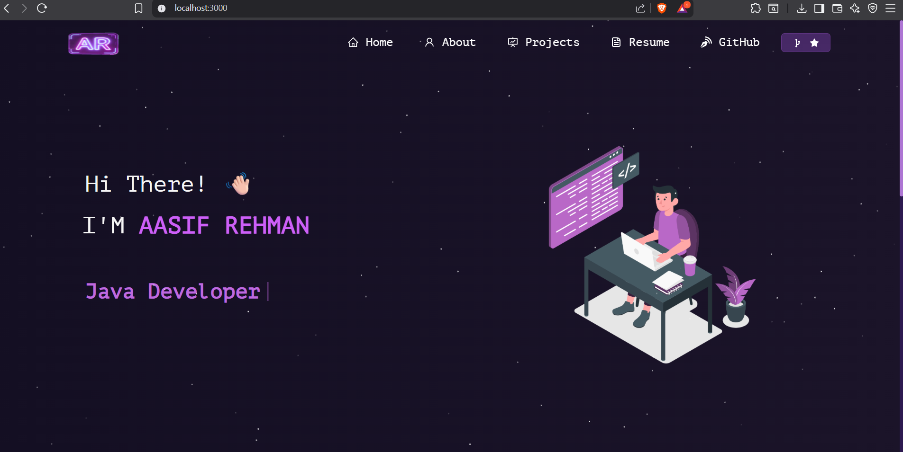

<h2 align="center">
  🚀 Aasif Rehman | Portfolio Website  
  <br/>
  <a href="https://vercel.com/asifs-projects-77d7787d" target="_blank">
    🌐 Live Portfolio
  </a>
</h2>

<div align="center">
  
</div>

<br/>

<p align="center">
  A modern and responsive personal portfolio website built with React.js.  
  Showcasing my projects, skills, resume, education, and experience.
</p>

<br/>

<p align="center">
  <a href="https://github.com/Asif-rehman012">
    
  </a>
  <a href="https://linkedin.com/aasifrehman-5979b5185/">
    
  </a>
  <a href="https://x.com/aasif_rehman012">
    
  </a>
</p>

<br/>

<p align="center">
  
  
  
</p>

---

## 📌 About This Project

This is my **personal portfolio website** built using **React.js** and **React-Bootstrap**.  
It highlights my skills, projects, achievements, resume, and experience in a clean and professional UI.

---

## ✨ Features

✅ Multi-Page Portfolio Layout  
✅ Modern UI with Smooth Animations  
✅ Fully Responsive (Mobile + Desktop)  
✅ Projects Showcase with GitHub Links  
✅ Resume PDF Download & Preview  
✅ GitHub Contribution Calendar  
✅ Easy Customization (Edit components only)

---

## 🛠 Tech Stack

This project was built using:

- **React.js**
- **React Router DOM**
- **React Bootstrap**
- **CSS3**
- **JavaScript**
- **React Icons**
- **Vercel (Deployment)**

---

## 📂 Project Structure

```bash
src/
 ├── components/
 │    ├── About/
 │    ├── Home/
 │    ├── Projects/
 │    ├── Resume/
 │    ├── Footer.js
 │    ├── Navbar.js
 │    └── Particle.js
 ├── Assets/
 ├── App.js
 ├── index.js
 └── style.css

## 🚀 Getting Started

### 📌 Clone the Repository
```bash
git clone https://github.com/Asif-rehman012/Portfolio.git
```
### 📌 Go to Project Directory
```bash
cd Portfolio
```

### 📌 Install Dependencies
```bash
npm install
```

### 📌 Run the Project
```bash
npm start
```

### ✅ Open in Browser
```bash
👉 http://localhost:3000
```

## 🖼 Preview

To add a preview screenshot in README:

📌 Place your screenshot inside:
```bash
Images/readme-img1.png
```

Then it will automatically appear in the README file.

## 🛠 Customization Guide

To edit your portfolio information, navigate to:
```bash
📌 src/components/
```
Update these files:

Home.jsx → Hero Section + Social Links

AboutCard.jsx → About Me Section

Projects.jsx → Projects List

ResumeNew.jsx → Resume PDF Link

## 📄 Resume Setup

To add your resume:

📌 Place your resume PDF inside:

public/asif-rehman.pdf


Then update the resume section if required.

## 🌍 Deployment

You can deploy this portfolio easily using Vercel 🚀

Steps:

Push your code to GitHub

Visit: https://vercel.com/

Import your repository

Click Deploy

## 👨‍💻 Author

Aasif Rehman
📌 Java Developer | Full Stack Developer | DSA Enthusiast

🔗 Connect With Me

GitHub: https://github.com/Asif-rehman012

LinkedIn: https://linkedin.com/aasifrehman-5979b5185/

X (Twitter): https://x.com/aasif_rehman012

## ⭐ Support

If you like this portfolio project, please give it a ⭐ on GitHub.
It motivates me to build more awesome projects 🚀🔥